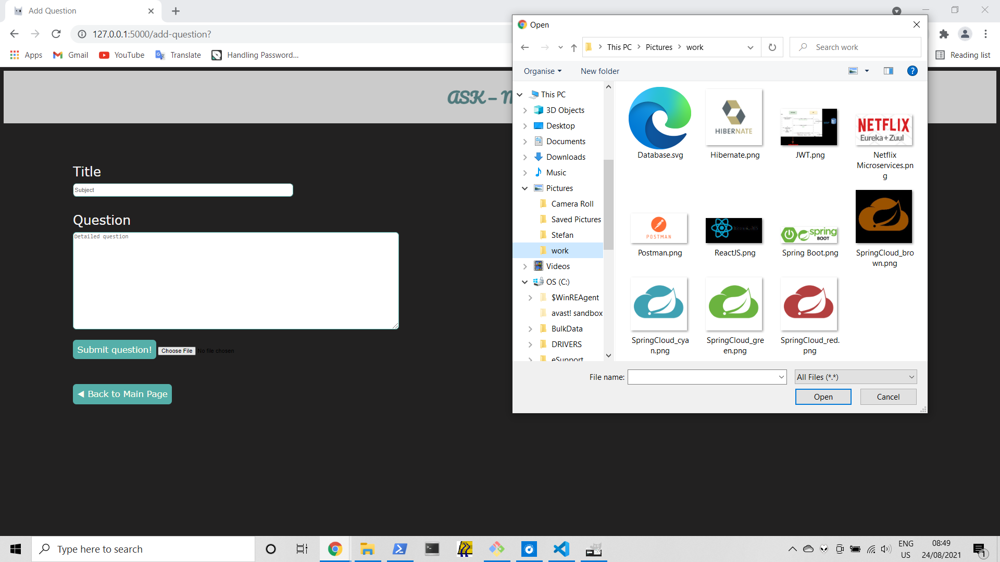
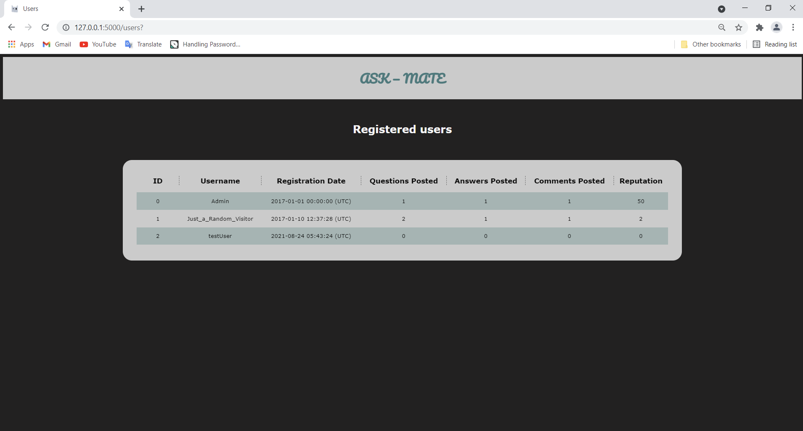

# AskMate (sprint 3)

## Story

Ask Mate is a web application designed to have the functionality of a forum.

Users may ask and answer questions, up-vote or down-vote questions based on their appreciation.  
Questions can be tagged (for reference).  
Both answers and questions can be edited if users feel they need to correct the wording in that topic.

### Users may upload images related to their questions/answers

The images are stored on the server's hard-disk.

### There is a reputation system awarded for questions that receive up-votes, visible in a user list (along with other info)

## Technologies

- Python
- Flask microframework for the back-end server
- Jinja for templating HTML served to the client
- PostgreSQL for persisting data

